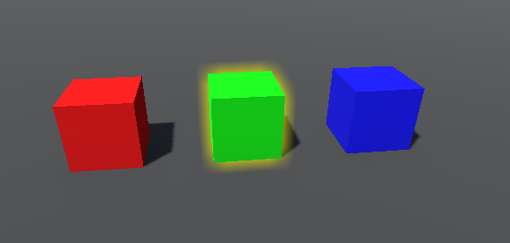

# Collision Object Mouseover System

A Godot plugin for highlighting CollisionObjects on mouseover.

## Credits

I based the idea for this plugin off the work by [Magodra](https://github.com/Magodra) in their [GlowBorderEffect](https://github.com/Magodra/GlowBorderEffect) addon, but I needed the ability to support skinned meshes and wanted to optimize the shaders a bit more so I implemented my own version.

## Installation

To install COMS: 

1. Download the latest ZIP Archive from [relases](https://github.com/nathanjf/Collision-Object-Mouseover-System/releases/).  

2. Extract the 'addons/' folder to your Godot project.

3. Enable the plugin in your Godot Project settings

## Use

COMS adds two new nodes to Godot: The HighlightObject and the HighlightRenderer.  The HighlightObject node will add and remove CollisionObjects from a specified render layer whenever they are moused over.  The HighlightRenderer contains a post processing pipeline that creates a highlight around objects on that same renderlayer and composites the outline ontop of the unmodified scene.

COMS works out of the box with just the proper configuration of the export variables.  That being said the export variables must be set properly for it to work.

Check out the included demo project for an example of the plugin in action.

## Features

### Curent

* Highlight objects on mouseover
* Per object color

### Planned

* Optional depth pass to obscure highlights partially behind objects