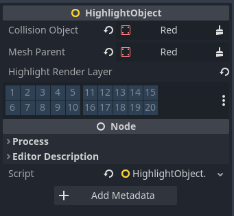
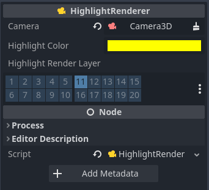

# Collision Object Mouseover System

A Godot plugin for highlighting CollisionObjects on mouseover.


## Credits

I based the idea for this plugin off the work by [Magodra](https://github.com/Magodra) in their [GlowBorderEffect](https://github.com/Magodra/GlowBorderEffect) addon, but I needed the ability to support skinned meshes and wanted to optimize the shaders a bit more so I implemented my own version.

## Installation

To install COMS: 

1. Download the latest ZIP Archive from [relases](https://github.com/nathanjf/Collision-Object-Mouseover-System/releases/).  

2. Extract the 'addons/' folder to your Godot project.

3. Enable the plugin in your Godot Project settings

## Use

COMS adds two new nodes to Godot: The HighlightObject and the HighlightRenderer.  The HighlightObject node will add and remove CollisionObjects from a specified render layer whenever they are moused over.  The HighlightRenderer contains a post processing pipeline that creates a highlight around objects on that same renderlayer and composites the outline ontop of the unmodified scene.

COMS works out of the box with just the proper configuration of the export variables.  That being said the export variables must be set properly for it to work.

Check out the included demo project for an example of the plugin in action.

### Setting up a Highlight Object

Add a Highlight object to every object in your scene that should be able to be highlighted.



- Collision Object

Each HighlightObject needs a reference to a CollisionObject3D.  This can be anything that inherits CollisionObject3D such as a StaticBody3D or a CharacterBody3D.  It is needed in order to get the ```mouse_entered``` and the ```mouse_exited``` signals.

- Mesh Parent

Each HighlightObject should have a reference to the parent of all the meshes that make up that object.  This can be any node and will vary widely depending on the project implementation.  The less children this node has, the better.  A recursive breadth first search of the children is done to gather all the MeshInstance3Ds that make up an object.

- Highlight Render Layer

This is the layer that object will be rendered to during the HighlightShader.  Make sure nothing else is on the layer you choose.

### Setting up a Highlight Renderer

There should only be one highlight rendered per scene.  The only requirement for a highlight renderer is that it needs to be in the same scene as the primary camera or in some other way connected to the camera.



- Camera

This is a reference to the active camera in the scene.  The highlight renderer has two internal camera that it uses to render the scene and the highlight effect.  It will disable the camera and update the transforms of the internal cameras to match your scene's camera.

- Highlight Color

This is the color that the highlight will render

- Highlight Render Layer

This must be the same as the layer the objects are rendering to.  This is the layer that the internal camera will use to draw the highlight.